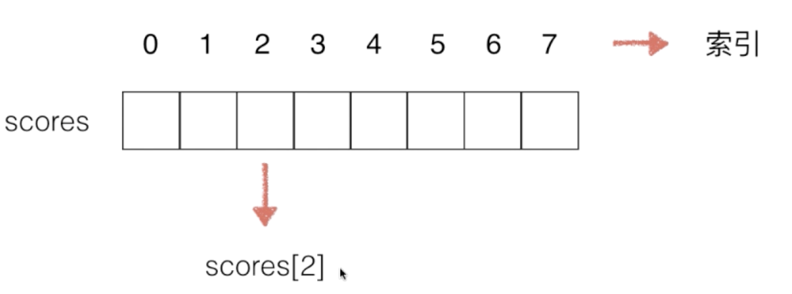

数据结构研究的是数据如何在计算机中进行组织和存储，使得我们可以高效的获取数据或者修改数据。

- 线性结构：数组、栈、队列、链表、哈希表
- 树结构：二叉树、二分搜索树、AVL、红黑树、Treap、Splay、堆、Trie、线段树、K-D树、并查集、哈夫曼树...
- 图结构：邻接矩阵、邻接表  

# 1.数组

思想：把数据码成一排进行存放。



## 1.1 二次封装属于自己的数组

```java
public class Array {

    private int[] data;
    private int size;

    // 构造函数，传入数组的容量capacity构造Array
    public Array(int capacity){
        data = new int[capacity];
        size = 0;
    }

    // 无参数的构造函数，默认数组的容量capacity=10
    public Array(){
        this(10);
    }

    // 获取数组的容量
    public int getCapacity(){
        return data.length;
    }

    // 获取数组中的元素个数
    public int getSize(){
        return size;
    }

    // 返回数组是否为空
    public boolean isEmpty(){
        return size == 0;
    }

    // 向所有元素后添加一个新元素
    public void addLast(int e){
        add(size, e);
    }

    // 在所有元素前添加一个新元素
    public void addFirst(int e){
        add(0, e);
    }

    // 在index索引的位置插入一个新元素e
    public void add(int index, int e){

        if(size == data.length)
            throw new IllegalArgumentException("Add failed. Array is full.");

        if(index < 0 || index > size)
            throw new IllegalArgumentException("Add failed. Require index >= 0 and index <= size.");

        for(int i = size - 1; i >= index ; i --)
            data[i + 1] = data[i];

        data[index] = e;

        size ++;
    }

    // 获取index索引位置的元素
    public int get(int index){
        if(index < 0 || index >= size)
            throw new IllegalArgumentException("Get failed. Index is illegal.");
        return data[index];
    }

    // 修改index索引位置的元素为e
    public void set(int index, int e){
        if(index < 0 || index >= size)
            throw new IllegalArgumentException("Set failed. Index is illegal.");
        data[index] = e;
    }

    // 查找数组中是否有元素e
    public boolean contains(int e){
        for(int i = 0 ; i < size ; i ++){
            if(data[i] == e)
                return true;
        }
        return false;
    }

    // 查找数组中元素e所在的索引，如果不存在元素e，则返回-1
    public int find(int e){
        for(int i = 0 ; i < size ; i ++){
            if(data[i] == e)
                return i;
        }
        return -1;
    }

    // 从数组中删除index位置的元素, 返回删除的元素
    public int remove(int index){
        if(index < 0 || index >= size)
            throw new IllegalArgumentException("Remove failed. Index is illegal.");

        int ret = data[index];
        for(int i = index + 1 ; i < size ; i ++)
            data[i - 1] = data[i];
        size --;
        return ret;
    }

    // 从数组中删除第一个元素, 返回删除的元素
    public int removeFirst(){
        return remove(0);
    }

    // 从数组中删除最后一个元素, 返回删除的元素
    public int removeLast(){
        return remove(size - 1);
    }

    // 从数组中删除元素e
    public void removeElement(int e){
        int index = find(e);
        if(index != -1)
            remove(index);
    }

    @Override
    public String toString(){

        StringBuilder res = new StringBuilder();
        res.append(String.format("Array: size = %d , capacity = %d\n", size, data.length));
        res.append('[');
        for(int i = 0 ; i < size ; i ++){
            res.append(data[i]);
            if(i != size - 1)
                res.append(", ");
        }
        res.append(']');
        return res.toString();
    }
}
```

测试代码如下：

```java
public class Main {
    public static void main(String[] args) {

        Array arr = new Array(20);
        for(int i = 0 ; i < 10 ; i ++)
            arr.addLast(i);
        System.out.println(arr);

        arr.add(1, 100);
        System.out.println(arr);

        arr.addFirst(-1);
        System.out.println(arr);
        // [-1, 0, 100, 1, 2, 3, 4, 5, 6, 7, 8, 9]

        arr.remove(2);
        System.out.println(arr);

        arr.removeElement(4);
        System.out.println(arr);

        arr.removeFirst();
        System.out.println(arr);
    }
}
```

## 1.2 使用泛型提升灵活性

目前这个数组不够灵活，只能处理`int`类型，不能处理其他类型。

现在使用`泛型`来改造这个二次封装的数组。

```java
public class Array<E> {

    private E[] data;
    private int size;

    // 构造函数，传入数组的容量capacity构造Array
    @SuppressWarnings("unchecked")
    public Array(int capacity){
        data = (E[]) new Object[capacity];
        size = 0;
    }

    // 无参数的构造函数，默认数组的容量capacity=10
    public Array(){
        this(10);
    }

    // 获取数组的容量
    public int getCapacity(){
        return data.length;
    }

    // 获取数组中的元素个数
    public int getSize(){
        return size;
    }

    // 返回数组是否为空
    public boolean isEmpty(){
        return size == 0;
    }

    // 向所有元素后添加一个新元素
    public void addLast(E e){
        add(size, e);
    }

    // 在所有元素前添加一个新元素
    public void addFirst(E e){
        add(0, e);
    }

    // 在index索引的位置插入一个新元素e
    public void add(int index, E e){

        if(size == data.length)
            throw new IllegalArgumentException("Add failed. Array is full.");

        if(index < 0 || index > size)
            throw new IllegalArgumentException("Add failed. Require index >= 0 and index <= size.");

        for(int i = size - 1; i >= index ; i --)
            data[i + 1] = data[i];

        data[index] = e;

        size ++;
    }

    // 获取index索引位置的元素
    public E get(int index){
        if(index < 0 || index >= size)
            throw new IllegalArgumentException("Get failed. Index is illegal.");
        return data[index];
    }

    // 修改index索引位置的元素为e
    public void set(int index, E e){
        if(index < 0 || index >= size)
            throw new IllegalArgumentException("Set failed. Index is illegal.");
        data[index] = e;
    }

    // 查找数组中是否有元素e
    public boolean contains(E e){
        for(int i = 0 ; i < size ; i ++){
            if(data[i].equals(e))
                return true;
        }
        return false;
    }

    // 查找数组中元素e所在的索引，如果不存在元素e，则返回-1
    public int find(E e){
        for(int i = 0 ; i < size ; i ++){
            if(data[i].equals(e))
                return i;
        }
        return -1;
    }

    // 从数组中删除index位置的元素, 返回删除的元素
    public E remove(int index){
        if(index < 0 || index >= size)
            throw new IllegalArgumentException("Remove failed. Index is illegal.");

        E ret = data[index];
        for(int i = index + 1 ; i < size ; i ++)
            data[i - 1] = data[i];
        size --;
        data[size] = null;
        return ret;
    }

    // 从数组中删除第一个元素, 返回删除的元素
    public E removeFirst(){
        return remove(0);
    }

    // 从数组中删除最后一个元素, 返回删除的元素
    public E removeLast(){
        return remove(size - 1);
    }

    // 从数组中删除元素e
    public void removeElement(E e){
        int index = find(e);
        if(index != -1)
            remove(index);
    }

    @Override
    public String toString(){

        StringBuilder res = new StringBuilder();
        res.append(String.format("Array: size = %d , capacity = %d\n", size, data.length));
        res.append('[');
        for(int i = 0 ; i < size ; i ++){
            res.append(data[i]);
            if(i != size - 1)
                res.append(", ");
        }
        res.append(']');
        return res.toString();
    }
}
```

测试代码如下：

```java
public class Main {
    public static void main(String[] args) {

        Array<Integer> arr = new Array<>(20);
        for(int i = 0 ; i < 10 ; i ++)
            arr.addLast(i);
        System.out.println(arr);

        arr.add(1, 100);
        System.out.println(arr);

        arr.addFirst(-1);
        System.out.println(arr);
        // [-1, 0, 100, 1, 2, 3, 4, 5, 6, 7, 8, 9]

        arr.remove(2);
        System.out.println(arr);

        arr.removeElement(4);
        System.out.println(arr);

        arr.removeFirst();
        System.out.println(arr);
    }
}

```

测试其他类型：把几个学生对象放进数组中。

```java
public class Student implements Comparable<Student>{

    private String name;
    private int score;

    public Student(String name, int score){
        this.name = name;
        this.score = score;
    }

    @Override
    public int compareTo(Student another){
        return another.score - this.score;
    }

    @Override
    public boolean equals(Object student){

        if(this == student)
            return true;

        if(student == null)
            return false;

        if(this.getClass() != student.getClass())
            return false;

        Student another = (Student)student;
        return this.score == another.score;
    }

    @Override
    public String toString(){
        return String.format("Student(name: %s, score: %d)", name, score);
    }

    public static void main(String[] args){

        Array<Student> arr = new Array<>();
        arr.addLast(new Student("Alice", 100));
        arr.addLast(new Student("Bob", 66));
        arr.addLast(new Student("Charlie", 88));
        System.out.println(arr);
    }
}
```


## 1.3 动态数组

目前我们这个数组的大小是固定的，不具有动态扩容的特性。

用户使用我们这个数组的时候，可以直接使用，不需要考虑初始数组的大小；

基本思路：

- 当我们进行添加的时候，发现数组满了，我们可以创建一个比原数组个数要大`2倍`的新数组，然后把**原数组**的元素**拷贝**到**新数组**中，最后在把新数组赋值给`data`。

- 当我们进行删除的时候，发现数组元素个数是数组空间一半的时候，我们进行**缩容**，缩小成原来的`1/2倍`，过程如`数组添加扩容时`一样，进行新旧数组的拷贝。

改造原来的`Array`代码，创建`resize()`方法，代码实现如下：

```java
public class Array<E> {

  	// ...此处省略代码
   	
    // 在index索引的位置插入一个新元素e
    public void add(int index, E e){

        if(index < 0 || index > size)
            throw new IllegalArgumentException("Add failed. Require index >= 0 and index <= size.");

        if(size == data.length)
            resize(2 * data.length); //进行2倍的扩容

        for(int i = size - 1; i >= index ; i --)
            data[i + 1] = data[i];

        data[index] = e;

        size ++;
    }

		// ...此处省略代码
  
    // 从数组中删除index位置的元素, 返回删除的元素
    public E remove(int index){
        if(index < 0 || index >= size)
            throw new IllegalArgumentException("Remove failed. Index is illegal.");

        E ret = data[index];
        for(int i = index + 1 ; i < size ; i ++)
            data[i - 1] = data[i];
        size --;
        data[size] = null; //便于java垃圾回收资源

        if(size == data.length / 2)
            resize(data.length / 2); //缩容原来的1/2倍
        
        return ret;
    }
  
		// ...此处省略代码

    // 将数组空间的容量变成newCapacity大小
    private void resize(int newCapacity){

        E[] newData = (E[])new Object[newCapacity];
        for(int i = 0 ; i < size ; i ++)
            newData[i] = data[i];
        data = newData;
    }
}

```

测试代码如下：

```java
public class Main {
    public static void main(String[] args) {

        Array<Integer> arr = new Array<>();
        for(int i = 0 ; i < 10 ; i ++)
            arr.addLast(i);
        System.out.println(arr);

        arr.add(1, 100);
        System.out.println(arr);

        arr.addFirst(-1);
        System.out.println(arr);

        arr.remove(2);
        System.out.println(arr);

        arr.removeElement(4);
        System.out.println(arr);

        arr.removeFirst();
        System.out.println(arr);
    }
}

```

运行结果如下：

```bash
Array: size = 10 , capacity = 10
[0, 1, 2, 3, 4, 5, 6, 7, 8, 9]  
Array: size = 11 , capacity = 20  //当我们添加一个元素后，数组进行了2倍扩容
[0, 100, 1, 2, 3, 4, 5, 6, 7, 8, 9]
Array: size = 12 , capacity = 20
[-1, 0, 100, 1, 2, 3, 4, 5, 6, 7, 8, 9]
Array: size = 11 , capacity = 20
[-1, 0, 1, 2, 3, 4, 5, 6, 7, 8, 9]
Array: size = 10 , capacity = 10  //当我们删除一个元素后，数组元素个数是数组空间的一半，则进行了1/2倍缩容
[-1, 0, 1, 2, 3, 5, 6, 7, 8, 9]
Array: size = 9 , capacity = 10
[0, 1, 2, 3, 5, 6, 7, 8, 9]
```

## 1.4 复杂度震荡


当我们的数组元素个数刚好等于数组空间的时候

添加一个元素后，数组进行扩容；删除一个元素后，数组进行缩容；

添加一个元素后，数组进行扩容；删除一个元素后，数组进行缩容.....

如此反复，会非常的消耗资源，这个叫`复杂度震荡`，所以我们要解决这个问题。


**出现这个问题的原因：`removeLast()`时`resize`过于着急（Eager）。**

**解决方案：Lazy（懒惰方式）**

该方案思想流程：

1.数组元素个数刚好等于数组空间大小。


2.我们添加一个元素的时候，数组进行扩容。


3.当我们删除一个元素，这时候数组元素个数刚好是数组空间的`1/2`，我们不着急现在就把数组空间进行缩容。


4.等删除到数组元素个数刚好是数组空间的`1/4`时，此时才进行数组空间的缩容，缩容数组空间为原来空间的`1/2`。


5.此时我们添加一个元素操作，也不会立即触发扩容操作，因为此时数组有预留出的空间。


> 核心思想：当size == capacity / 4，才将capacity减半。
>
> （size：数组元素个数，capacity：空间大小）


改善之前的代码，让它防止`复杂度震荡`，代码改动如下：

在`Array`类的`remove()`方法中

把之前的代码：

```java
if(size == data.length / 2)
            resize(data.length / 2);
```

修改成：

```java
if(size == data.length / 4 && data.length != 0)
            resize(data.length / 2);
```


# 2.栈 (Stack)

## 2.1 栈的简介

- 栈也是一种线性结构
- 相比数组，栈对应的操作是数组的子集
- 只能从一端添加元素，也只能从另一端取出元素
- 这一端称为栈顶

栈的入栈和出栈图示操作：


存储元素`1`


存储元素`2`


接着添加`3`和`4`


从栈中取出一个元素，也就是从栈中删除一个元素，这种称为出栈。


通过上面图示结果说明：

**栈是一种后进先出的数据结构。**


## 2.2 栈的基本实现


我们需要定义一个栈接口`Stack`，有如下几个接口方法：

> void push(E)
>
> E pop()
>
> E peek()
>
> int getSize()
>
> boolean isEmpty()

```java
public interface Stack<E> {

    int getSize();
    boolean isEmpty();
    void push(E e);
    E pop();
    E peek();

}

```

然后创建一个基于动态数组`Array`的栈`ArrayStack`，实现`Stack`接口。

Array类

```java
public class Array<E> {

    private E[] data;
    private int size;

    // 构造函数，传入数组的容量capacity构造Array
    @SuppressWarnings("unchecked")
    public Array(int capacity){
        data = (E[]) new Object[capacity];
        size = 0;
    }

    // 无参数的构造函数，默认数组的容量capacity=10
    public Array(){
        this(10);
    }

    // 获取数组的容量
    public int getCapacity(){
        return data.length;
    }

    // 获取数组中的元素个数
    public int getSize(){
        return size;
    }

    // 返回数组是否为空
    public boolean isEmpty(){
        return size == 0;
    }

    // 向所有元素后添加一个新元素
    public void addLast(E e){
        add(size, e);
    }

    // 在所有元素前添加一个新元素
    public void addFirst(E e){
        add(0, e);
    }

    // 在index索引的位置插入一个新元素e
    public void add(int index, E e){

        if(index < 0 || index > size)
            throw new IllegalArgumentException("Add failed. Require index >= 0 and index <= size.");

        if(size == data.length)
            resize(2 * data.length);

        for(int i = size - 1; i >= index ; i --)
            data[i + 1] = data[i];

        data[index] = e;

        size ++;
    }

    // 获取index索引位置的元素
    public E get(int index){
        if(index < 0 || index >= size)
            throw new IllegalArgumentException("Get failed. Index is illegal.");
        return data[index];
    }

    // 获取数组最后一个元素
    public E getLast() {
        return get(size - 1);
    }

    // 获取数组第一个元素
    public E getFirst() {
        return get(0);
    }

    // 修改index索引位置的元素为e
    public void set(int index, E e){
        if(index < 0 || index >= size)
            throw new IllegalArgumentException("Set failed. Index is illegal.");
        data[index] = e;
    }

    // 查找数组中是否有元素e
    public boolean contains(E e){
        for(int i = 0 ; i < size ; i ++){
            if(data[i].equals(e))
                return true;
        }
        return false;
    }

    // 查找数组中元素e所在的索引，如果不存在元素e，则返回-1
    public int find(E e){
        for(int i = 0 ; i < size ; i ++){
            if(data[i].equals(e))
                return i;
        }
        return -1;
    }

    // 从数组中删除index位置的元素, 返回删除的元素
    public E remove(int index){
        if(index < 0 || index >= size)
            throw new IllegalArgumentException("Remove failed. Index is illegal.");

        E ret = data[index];
        for(int i = index + 1 ; i < size ; i ++)
            data[i - 1] = data[i];
        size --;
        data[size] = null; //便于java垃圾回收资源

        if(size == data.length / 4 && data.length != 0)
            resize(data.length / 2);

        return ret;
    }

    // 从数组中删除第一个元素, 返回删除的元素
    public E removeFirst(){
        return remove(0);
    }

    // 从数组中删除最后一个元素, 返回删除的元素
    public E removeLast(){
        return remove(size - 1);
    }

    // 从数组中删除元素e
    public void removeElement(E e){
        int index = find(e);
        if(index != -1)
            remove(index);
    }

    @Override
    public String toString(){

        StringBuilder res = new StringBuilder();
        res.append(String.format("Array: size = %d , capacity = %d\n", size, data.length));
        res.append('[');
        for(int i = 0 ; i < size ; i ++){
            res.append(data[i]);
            if(i != size - 1)
                res.append(", ");
        }
        res.append(']');
        return res.toString();
    }

    // 将数组空间的容量变成newCapacity大小
    private void resize(int newCapacity){

        E[] newData = (E[])new Object[newCapacity];
        for(int i = 0 ; i < size ; i ++)
            newData[i] = data[i];
        data = newData;
    }
}
```

ArrayStack类

```java
public class ArrayStack<E> implements Stack<E> {

    Array<E> array;

    public ArrayStack(int capacity) {
        array = new Array<>(capacity);
    }

    public ArrayStack() {
        array = new Array<>();
    }

    public int getCapacity() {
        return array.getCapacity();
    }

    @Override
    public int getSize() {
        return array.getSize();
    }

    @Override
    public boolean isEmpty() {
        return array.isEmpty();
    }

    @Override
    public void push(E e) {
        array.addLast(e);
    }

    @Override
    public E pop() {
        return array.removeLast();
    }

    @Override
    public E peek() {
        return array.getLast();
    }

    @Override
    public String toString(){
        StringBuilder res = new StringBuilder();
        res.append("Stack: ");
        res.append('[');
        for(int i = 0 ; i < array.getSize() ; i ++){
            res.append(array.get(i));
            if(i != array.getSize() - 1)
                res.append(", ");
        }
        res.append("] top");
        return res.toString();
    }
}
```

测试动态数组栈的使用，往栈中推入5个元素，在出栈一个元素。

```java
public class Main {
    public static void main(String[] args) {

        ArrayStack<Integer> stack = new ArrayStack<>();

        for(int i = 0 ; i < 5 ; i ++){
            stack.push(i);
            System.out.println(stack);
        }

        stack.pop();
        System.out.println(stack);
    }
}
```

运行结果如下：

```bash
Stack: [0] top
Stack: [0, 1] top
Stack: [0, 1, 2] top
Stack: [0, 1, 2, 3] top
Stack: [0, 1, 2, 3, 4] top
Stack: [0, 1, 2, 3] top
```

> 栈顶在数组的最右边


# 3.队列（Queue）

## 3.1 队列的简介

- 队列也是一种线性结构
- 相比数组，队列对应的操作是数组的子集
- 只能从一端（队尾）添加元素，只能从另一端（队首）取出元素

队列的添加和取出图示操作：

1. 有一个空队列


2. 添加一个元素`1`，从队尾的位置进入队列


3. 依次类推，添加元素`2`、`3`。


4. 如果现在要进行出队操作，则取出一个元素，从队首中取出。


通过上述队列进出操作图示，可以得出结论：

**队列是一种先进先出的数据结构（FIFO）**

## 3.2 队列的基本实现

新建一个队列接口定义`Queue`，有如下接口方法：

```java
public interface Queue<E> {

    int getSize();
    boolean isEmpty();
    void enqueue(E e);
    E dequeue();
    E getFront();
}
```

新建一个基于动态数组`Array`的队列`ArrayQueue`

```java
public class ArrayQueue<E> implements Queue<E> {

    private Array<E> array;

    public ArrayQueue(int capacity) {
        array = new Array<>(capacity);
    }
    public ArrayQueue() {
        array = new Array<>();
    }

    public int getCapacity() {
        return array.getCapacity();
    }

    @Override
    public int getSize() {
        return array.getSize();
    }

    @Override
    public boolean isEmpty() {
        return array.isEmpty();
    }

    @Override
    public void enqueue(E e) {
        array.addLast(e);
    }

    @Override
    public E dequeue() {
        return array.removeFirst();
    }

    @Override
    public E getFront() {
        return array.getFirst();
    }

    @Override
    public String toString(){
        StringBuilder res = new StringBuilder();
        res.append("Queue: ");
        res.append("front [");
        for(int i = 0 ; i < array.getSize() ; i ++){
            res.append(array.get(i));
            if(i != array.getSize() - 1)
                res.append(", ");
        }
        res.append("] tail");
        return res.toString();
    }

    public static void main(String[] args) {

        ArrayQueue<Integer> queue = new ArrayQueue<>();
        for(int i = 0 ; i < 10 ; i ++){
            queue.enqueue(i);
            System.out.println(queue);
          
            if(i % 3 == 2){ //每循环三次，进行一次出队操作。
                queue.dequeue();
                System.out.println(queue);
            }
        }
    }
}
```

测试结果如下：

```bash
Queue: front [0] tail
Queue: front [0, 1] tail
Queue: front [0, 1, 2] tail
Queue: front [1, 2] tail
Queue: front [1, 2, 3] tail
Queue: front [1, 2, 3, 4] tail
Queue: front [1, 2, 3, 4, 5] tail
Queue: front [2, 3, 4, 5] tail
Queue: front [2, 3, 4, 5, 6] tail
Queue: front [2, 3, 4, 5, 6, 7] tail
Queue: front [2, 3, 4, 5, 6, 7, 8] tail
Queue: front [3, 4, 5, 6, 7, 8] tail
Queue: front [3, 4, 5, 6, 7, 8, 9] tail
```


## 3.3 循环队列


上面数组元素`a`被移除，但是队尾指针已经到数组的上界，不能在继续有入队操作，浪费了前面的空间资源。

**结论：**在数组队列（顺序队列）中，当队尾指针已经到数组的上界，不能再有入队操作，但其实数组中还有空位置，这就叫做“假溢出”，解决假溢出的途径---- 采用**循环队列**。**利用循环来解决空间浪费的问题**。


采用循环队列的做法：

有一个队列[a, b, c, d, e, .....]，队尾指针`tail`指向`5`，队首指针`front`指向`0`


现在出队一个元素，把`a`出队，相应的`front+1`


再出队一个元素`b`，相应的`front+1`


如果现在有新元素进队了，`f`、`g`、`h`相应进队，`tail++`


现在队尾指针到数组上界了，但是，由于元素挪出我们数组之后，这个空间没有被后面的元素给挤掉，所以呢，相当于我们数组来说，前面有可能还有可以利用的空间。这就是我们`循环队列`的来由。

此时，我们可以理解成，把我们的数组看成一个**环**，现在这个数组中一共可以容纳`8`个元素，对应的索引是`0~7`，那么`7`之后的索引，其实是`0`。

> 索引7之后是怎么计算成索引0的，是（7+1）%数组长度 = 8%8 = 0


当有一个新元素`i`进队时，`tail++`，指向索引`1`


**当tail==front的时候，队列可能是满，也可能是空。**

因为存在满和空两种情况，我们需要分别判断：

　☆**满**：当队列添加元素到`tail`的下一个元素是`front`的时候，也就是转圈子要碰头了，我们就认为队列满了。(**Q.tail+1)%MAXSIZE==Q.front**

　☆**空**：当队列删除元素到`front==tail`的时候，我们认为队列空了。**Q.tail==Q.front（不一定为0）**

**缺点：在所有数组空间中，我们浪费了一个空间。**


## 3.4 代码实现

```java
import java.util.Objects;

/**
 * @Author zzm
 * @CreateTime 2021/1/10 16:20
 * @Description 循环队列
 */
public class LoopQueue<E> implements Queue<E> {

    private E[] data;
    private int front, tail;
    private int size;

    @SuppressWarnings("unchecked")
    public LoopQueue(int capacity) {
        data = (E[]) new Object[capacity + 1];
        front = 0;
        tail = 0;
        size = 0;
    }

    public LoopQueue() {
        this(5);
    }

    public int getCapacity() {
        return data.length - 1;
    }

    @Override
    public int getSize() {
        return size;
    }

    @Override
    public boolean isEmpty() {
        return front == tail;
    }

    @Override
    public void enqueue(E e) {
        boolean isFull = (tail + 1) % data.length == front;
        if (isFull)
            resize(getCapacity() * 2);

        data[tail] = e;
        tail = (tail + 1) % data.length;
        size ++;
    }

    @Override
    public E dequeue() {
        if (isEmpty())
            throw new IllegalArgumentException("Cannot dequeue from an empty queue.");

        E ret = data[front];
        data[front] = null;
        front = (front + 1) % data.length;
        size --;

        //如果元素个数只有空间的四分之一，把数组空间缩容二分之一。
        if (size == getCapacity() / 4 && getCapacity() / 2 != 0) {
            resize(getCapacity() / 2);
        }

        return ret;
    }

    @Override
    public E getFront() {
        if (isEmpty())
            throw new IllegalArgumentException("Cannot dequeue from an empty queue.");
        return data[front];
    }

    @SuppressWarnings("unchecked")
    private void resize(int newCapacity) {
        E[] newData = (E[]) new Object[newCapacity + 1];

        for(int i = 0; i < size; i++) {
            newData[i] = data[(i + front) % data.length];
        }

        data = newData;
        front = 0;
        tail = size;
    }

    @Override
    public String toString(){

        StringBuilder res = new StringBuilder();
        res.append(String.format("Queue: size = %d , capacity = %d\n", size, getCapacity()));
        res.append("front [");
        for(int i = front ; i != tail ; i = (i + 1) % data.length){
            res.append(data[i]);
            if((i + 1) % data.length != tail)
                res.append(", ");
        }
        res.append("] tail");
        return res.toString();
    }

    public static void main(String[] args){

        LoopQueue<Integer> queue = new LoopQueue<>();
        for(int i = 0 ; i < 10 ; i ++){
            queue.enqueue(i);
            System.out.println(queue);

            if(i % 3 == 2){
                queue.dequeue();
                System.out.println(queue);
            }
        }
    }

}
```


## 3.5 数组队列和循环队列的比较

写一个测试方法，测试数组队列和循环队列的运行时间。

```java
import java.util.Random;

public class Main {

    // 测试使用q运行opCount个enqueueu和dequeue操作所需要的时间，单位：秒
    private static double testQueue(Queue<Integer> q, int opCount){

        long startTime = System.nanoTime();

        Random random = new Random();
        for(int i = 0 ; i < opCount ; i ++)
            q.enqueue(random.nextInt(Integer.MAX_VALUE));
        for(int i = 0 ; i < opCount ; i ++)
            q.dequeue();

        long endTime = System.nanoTime();

        return (endTime - startTime) / 1000000000.0;
    }

    public static void main(String[] args) {

        int opCount = 100000;

        ArrayQueue<Integer> arrayQueue = new ArrayQueue<>();
        double time1 = testQueue(arrayQueue, opCount);
        System.out.println("ArrayQueue, time: " + time1 + " s");

        LoopQueue<Integer> loopQueue = new LoopQueue<>();
        double time2 = testQueue(loopQueue, opCount);
        System.out.println("LoopQueue, time: " + time2 + " s");
    }
}
```

运行结果如下：

```bash
ArrayQueue, time: 3.147567347 s
LoopQueue, time: 0.012601597 s
```

结论：循环队列的运行速度远高于数组队列。由于`ArrayQueue数组队列`出队每一个元素的时候都需要把之后所有队列中的元素向前移动一个位置，所以复杂度为O(n)，而`LoopQueue循环队列`出队的时间复杂度为O(1)。


## 3.6 如何实现不浪费一个空间的循环队列

实际上，如果我们想要实现一个队列，使用 size 记录了队列中有多少元素，完全可以不浪费那一个空间。

> 使用size实现不浪费一个空间的循环队列，首先要明白为什么需要浪费一个空间，是因为在判断一队列是否为空时，条件是(front == tail 初始化状态)，如果该队列一直入队，可能会再次出现front == tail的情况（队列已满），此时就不能再入队，因为队列已满，这样无疑和判断队列为空的条件矛盾了。所以为了实现队列不同状态条件的判断，就需要浪费一个空间，即(tail + 1) % data.length == front的情况下，表示队列已满
> 回归正题，想要不浪费空间实现循环队列，就应该做到不使用front和tail来判断队列的空满状态，所以可以使用size来判断队列的空满状态。   

**下面提供的参考代码，注意其中注释的位置，就是修改的地方。**

```java
private E[] data;
private int front, tail;
private int size;

public LoopQueue(int capacity){
    data = (E[])new Object[capacity]; // 由于不浪费空间，所以data静态数组的大小是capacity
                                      // 而不是capacity + 1
    front = 0;
    tail = 0;
    size = 0;
}

public LoopQueue(){
    this(10);
}

public int getCapacity(){
    return data.length;
}

@Override
public boolean isEmpty(){
    // 注意，我们不再使用front和tail之间的关系来判断队列是否为空，而直接使用size
    return size == 0;
}

@Override
public int getSize(){
    return size;
}

@Override
public void enqueue(E e){

    // 注意，我们不再使用front和tail之间的关系来判断队列是否为满，而直接使用size
    if(size == getCapacity())
        resize(getCapacity() * 2);

    data[tail] = e;
    tail = (tail + 1) % data.length;
    size ++;
}

@Override
public E dequeue(){

    if(isEmpty())
        throw new IllegalArgumentException("Cannot dequeue from an empty queue.");

    E ret = data[front];
    data[front] = null;
    front = (front + 1) % data.length;
    size --;
    if(size == getCapacity() / 4 && getCapacity() / 2 != 0)
        resize(getCapacity() / 2);
    return ret;
}

@Override
public E getFront(){
    if(isEmpty())
        throw new IllegalArgumentException("Queue is empty.");
    return data[front];
}

private void resize(int newCapacity){

    E[] newData = (E[])new Object[newCapacity];
    for(int i = 0 ; i < size ; i ++)
        newData[i] = data[(i + front) % data.length];

    data = newData;
    front = 0;
    tail = size;
}

@Override
public String toString(){

    StringBuilder res = new StringBuilder();
    res.append(String.format("Queue: size = %d , capacity = %d\n", size, getCapacity()));
    res.append("front [");

    // 注意，我们的循环遍历打印队列的逻辑也有相应的更改 :-)
    for(int i = 0; i < size; i ++){
        res.append(data[(front + i) % data.length]);
        if((i + front + 1) % data.length != tail)
            res.append(", ");
    }
    res.append("] tail");
    return res.toString();
}

public static void main(String[] args){

    LoopQueue<Integer> queue = new LoopQueue<>();
    for(int i = 0 ; i < 10 ; i ++){
        queue.enqueue(i);
        System.out.println(queue);

        if(i % 3 == 2){
            queue.dequeue();
            System.out.println(queue);
        }
    }
}
```


## 3.7 如何实现没有size成员变量的循环队列

**实现目标：浪费一个空间，但不使用 size 实现队列**

如果我们不使用 **size**，也完全可以实现整个队列，但是，相应的，我们需要浪费一个空间。

下面的代码是我提供的参考代码，这个队列实现中不再用 **size**，注意其中注释的位置，就是修改的地方。

```java
// 在这一版本的实现中，我们完全不使用size，只使用front和tail来完成LoopQueue的所有逻辑.
public class LoopQueue implements Queue {
    private E[] data;
    private int front, tail;

    public LoopQueue(int capacity){
        data = (E[])new Object[capacity + 1];
        front = 0;
        tail = 0;
    }

    public LoopQueue(){
        this(10);
    }

    public int getCapacity(){
        return data.length - 1;
    }

    @Override
    public boolean isEmpty(){
        return front == tail;
    }

    @Override
    public int getSize(){
        // 注意此时getSize的逻辑:
        // 如果tail >= front，非常简单，队列中的元素个数就是tail - front
        // 如果tail < front，说明我们的循环队列"循环"起来了，此时，队列中的元素个数为：
        // tail - front + data.length
        // 画画图，看能不能理解为什么？
        //
        // 也可以理解成，此时，data中没有元素的数目为front - tail,
        // 整体元素个数就是 data.length - (front - tail) = data.length + tail - front
        return tail >= front ? tail - front : tail - front + data.length;
    }

    @Override
    public void enqueue(E e){

        if((tail + 1) % data.length == front)
            resize(getCapacity() * 2);

        data[tail] = e;
        tail = (tail + 1) % data.length;
    }

    @Override
    public E dequeue(){

        if(isEmpty())
            throw new IllegalArgumentException("Cannot dequeue from an empty queue.");

        E ret = data[front];
        data[front] = null;
        front = (front + 1) % data.length;
        if(getSize() == getCapacity() / 4 && getCapacity() / 2 != 0)
            resize(getCapacity() / 2);
        return ret;
    }

    @Override
    public E getFront(){
        if(isEmpty())
            throw new IllegalArgumentException("Queue is empty.");
        return data[front];
    }

    private void resize(int newCapacity){

        E[] newData = (E[])new Object[newCapacity + 1];
        int sz = getSize();
        for(int i = 0 ; i < sz ; i ++)
            newData[i] = data[(i + front) % data.length];

        data = newData;
        front = 0;
        tail = sz;
    }

    @Override
    public String toString(){

        StringBuilder res = new StringBuilder();
        res.append(String.format("Queue: size = %d , capacity = %d\n", getSize(), getCapacity()));
        res.append("front [");
        for(int i = front ; i != tail ; i = (i + 1) % data.length){
            res.append(data[i]);
            if((i + 1) % data.length != tail)
                res.append(", ");
        }
        res.append("] tail");
        return res.toString();
    }

    public static void main(String[] args){

        LoopQueue<Integer> queue = new LoopQueue<>();
        for(int i = 0 ; i < 10 ; i ++){
            queue.enqueue(i);
            System.out.println(queue);

            if(i % 3 == 2){
                queue.dequeue();
                System.out.println(queue);
            }
        }
    }
}
```

> 【说明】：其实和第一版实现的循环队列只有一个地方不同，就是getSize()方法的实现，第一版中是直接返回size这个成员变量，如果不使用size，就要借助front和tail来求出size.
> 可以想象一下时钟
> 上午10点(front) 下午1点(tail) 它们之间的差了几个小时呢
> 计算方法 1 + 12 - 10 = 3
> 循环队列的方法一样的
> 即 size = tail + data.length - front       


## 3.8 实现双端队列

对于双端队列，其实 **removeFront** 和循环队列中的 **dequeue** 是一样的；**addLast** 和循环队列中的 **enqueue** 是一样的。

关键是实现 **addFront** 和 **removeLast** 两个方法。而这两个方法的实现，关键在于计算出正确的，做出添加和删除操作以后，**front** 和 **last**。

在下面的代码中，我将使用 **size** 来表示双端队列中的元素个数。于此同时，我们的双端队列不浪费空间。

```java
/**
 * @Author zzm
 * @CreateTime 2021/1/14 12:32
 * @Description 双端队列
 */
@SuppressWarnings("unchecked")
public class Deque<E> {

    private E[] data;
    private int front, tail;
    private int size; // 方便起见，我们的 Deque 实现，将使用 size 记录 deque 中存储的元素数量

    public Deque(int capacity) {
        data = (E[]) new Object[capacity]; // 由于使用 size，我们的 Deque 实现不浪费空间
        this.front = 0;
        this.tail = 0;
        this.size = 0;
    }

    public Deque() {
        this(10);
    }

    public int getCapacity() {
        return data.length;
    }

    public int getSize() {
        return size;
    }

    public boolean isEmpty() {
        return size == 0;
    }

    // addLast 的逻辑和我们之前实现的队列中的 enqueue 的逻辑是一样的
    public void addLast(E e) {
        if (size == getCapacity())
            resize(getCapacity() * 2);

        data[tail] = e;
        tail = (tail + 1) % data.length;
        size ++;
    }

    // addFront 是新的方法，请大家注意
    public void addFront(E e) {
        if (size == getCapacity())
            resize(getCapacity() * 2);

        // 我们首先需要确定添加新元素的索引位置
        // 这个位置是 front - 1 的地方
        // 但是要注意，如果 front == 0，新的位置是 data.length - 1 的位置
        this.front = front == 0 ? data.length - 1 : front - 1;
        data[front] = e;
        size ++;
    }

    // removeFront 的逻辑和我们之前实现的队列中的 dequeue 的逻辑是一样的
    public E removeFront() {
        if (isEmpty())
            throw new IllegalArgumentException("Cannot dequeue from an empty queue.");

        E ret = data[front];
        data[front] = null;
        front = (front + 1) % data.length;
        size --;

        if (getSize() == getCapacity() / 4 && getCapacity() / 2 != 0)
            this.resize(getCapacity() / 2);

        return ret;
    }

    // removeLast 是新的方法，请大家注意
    public E removeLast() {
        if (isEmpty())
            throw new IllegalArgumentException("Cannot dequeue from an empty queue.");

        // 计算删除掉队尾元素以后，新的 tail 位置
        this.tail = tail == 0 ? data.length - 1 : tail - 1;
        E ret = data[tail];
        data[tail] = null;
        size --;

        if (getSize() == getCapacity() / 4 && getCapacity() / 2 != 0)
            this.resize(getCapacity() / 2);

        return ret;
    }

    public E getFront() {
        if (isEmpty())
            throw new IllegalArgumentException("Cannot dequeue from an empty queue.");

        return data[front];
    }

    // 因为是双端队列，我们也有一个 getLast 的方法，来获取队尾元素的值
    public E getLast() {
        if (isEmpty())
            throw new IllegalArgumentException("Cannot dequeue from an empty queue.");

        // 因为 tail 指向的是队尾元素的下一个位置，我们需要计算一下真正队尾元素的索引
        int index = tail == 0 ? data.length - 1 : tail - 1;
        return data[index];
    }

    private void resize(int newCapacity) {
        E[] newData = (E[]) new Object[newCapacity];
        for (int i = 0; i < size; i++) {
            newData[i] = data[(i + front) % data.length];
        }

        data = newData;
        this.front = 0;
        this.tail = size;
    }

    @Override
    public String toString(){

        StringBuilder res = new StringBuilder();
        res.append(String.format("Queue: size = %d , capacity = %d\n", getSize(), getCapacity()));
        res.append("front [");
        for(int i = 0 ; i < size ; i ++){
            res.append(data[(i + front) % data.length]);
            if(i != size - 1)
                res.append(", ");
        }
        res.append("] tail");
        return res.toString();
    }

    public static void main(String[] args) {
        // 在下面的双端队列的测试中，偶数从队尾加入；奇数从队首加入
        Deque<Integer> dq = new Deque<>();
        for (int i = 0; i < 16; i++) {
            if (i % 2 == 0)
                dq.addLast(i);
            else
                dq.addFront(i);
            System.out.println(dq);
        }

        // 之后，我们依次从队首和队尾轮流删除元素
        System.out.println();
        for (int i = 0; !dq.isEmpty(); i++) {
            if(i % 2 == 0) dq.removeFront();
            else dq.removeLast();
            System.out.println(dq);
        }
    }
}
```

> 修改点
> 1.addLast 重新计算 front 需处理队尾
> 2.removeLast 重新计算 tail 需处理队尾
> 3.getLast 需重新计算获取最后一个元素位置     